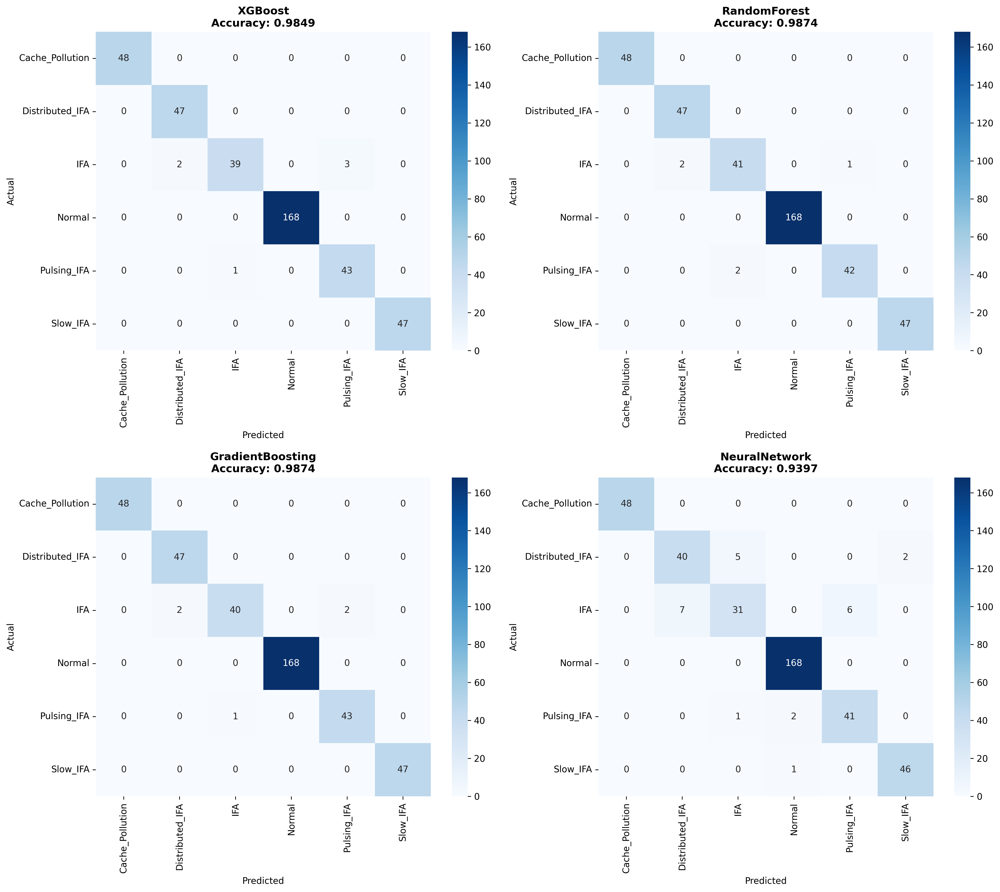
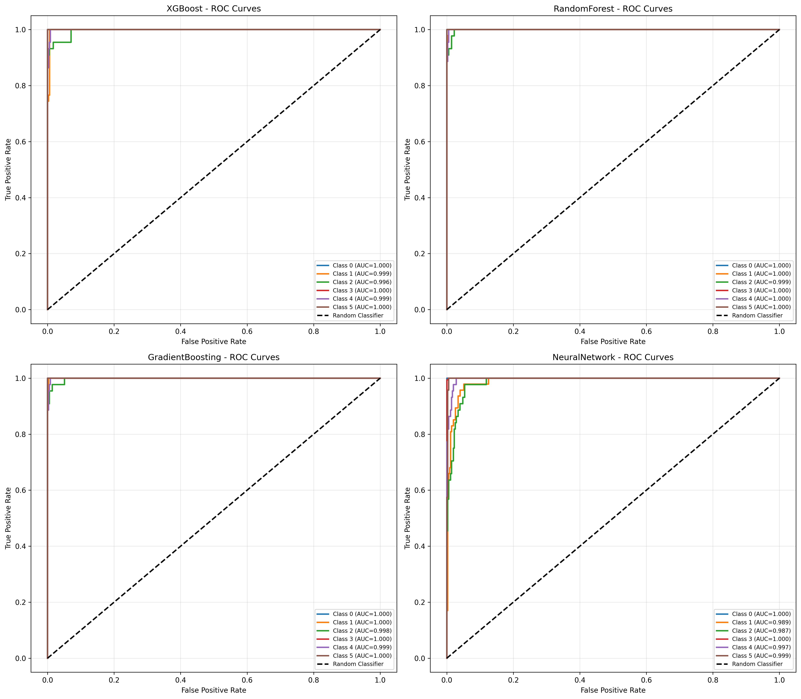
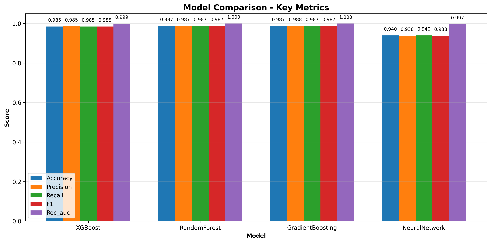
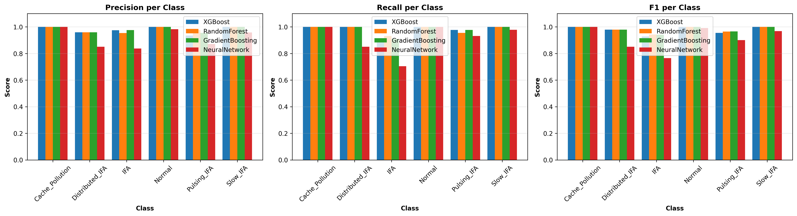
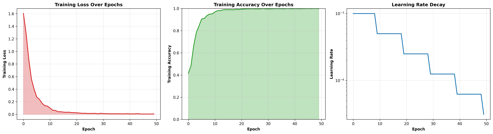
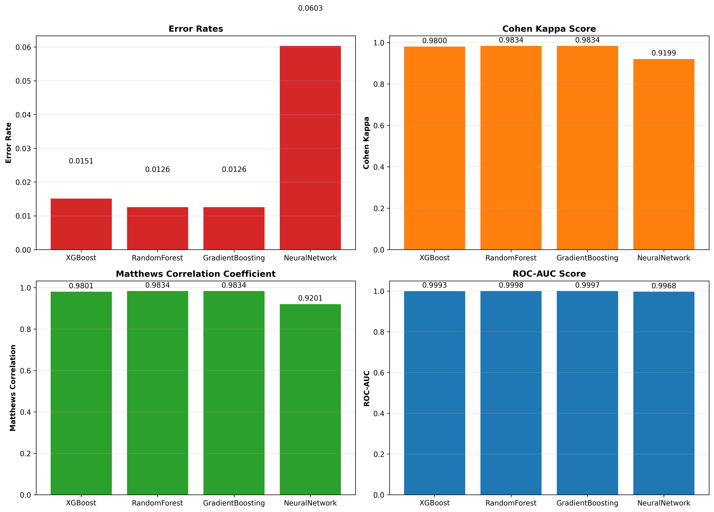

# Multi-Model Detection of Interest Flooding Attacks in Named Data Networking

Project Type: Model Comparison and Attack Classification 
Dataset: ndnSIM traffic logs (2,000 records, 6 classes) 
Best Model: Random Forest

---

## Executive Summary

This report presents a clean comparison of four models for detecting NDN attacks: XGBoost, Random Forest, Gradient Boosting, and a 1D CNN.

The best model is Random Forest. It gives the strongest balance of accuracy, speed, and reliability.

### Final Best Result (Random Forest)

| Metric | Value |
|---|---:|
| Accuracy | 98.74% |
| Precision | 98.75% |
| Recall | 98.74% |
| F1-score | 98.74% |
| ROC-AUC | 99.98% |
| Error rate | 1.26% |
| Inference time | 0.08 ms/window |

The model correctly classifies normal traffic and most attack traffic. Only five windows are misclassified in the 398-window test set.

## 1) Data Used

### 1.1 Dataset shape

| Item | Value |
|---|---:|
| Total records | 2,000 |
| Raw features per record | 10 |
| Engineered features added | 7 |
| Final features used | 17 |
| Classes | 6 |

### 1.2 Class distribution

| Class | Count | Share |
|---|---:|---:|
| Normal | 841 | 42.05% |
| IFA | 223 | 11.15% |
| Slow_IFA | 235 | 11.75% |
| Cache_Pollution | 241 | 12.05% |
| Distributed_IFA | 235 | 11.75% |
| Pulsing_IFA | 225 | 11.25% |

### 1.3 Time window setup

To include short-term traffic behavior, records are converted into 10-step sliding windows.

| Item | Value |
|---|---:|
| Window size | 10 time steps |
| Total windows | 1,990 |
| Train/Test split | 1,592 / 398 |
| Window shape for CNN | (batch, 10, 17) |
| Shape for tree models | (batch, 170) |

## 2) Features

### 2.1 Raw features (10)

InInterests, InData, InNacks, InSatisfiedInterests, InTimedOutInterests, OutInterests, OutData, OutNacks, OutSatisfiedInterests, OutTimedOutInterests

### 2.2 Engineered features (7)

| Feature | Meaning |
|---|---|
| interest_rate | Total incoming + outgoing interests |
| data_rate | Total incoming + outgoing data packets |
| satisfaction_ratio | Share of interests that are satisfied |
| timeout_ratio | Share of interests that time out |
| nack_ratio | Share of interests that return NACKs |
| pit_occupancy | Pending interest load proxy |
| network_load | Approximate total traffic volume |

## 3) Model Setup

| Model | Main settings |
|---|---|
| XGBoost | 200 trees, depth 7, learning rate 0.1, subsample 0.8 |
| Random Forest | 200 trees, depth 20, min split 5, min leaf 2 |
| Gradient Boosting | 200 trees, depth 6, learning rate 0.1, subsample 0.8 |
| 1D CNN | 3 Conv blocks + dense head, 50 epochs, StepLR decay |

## 4) Model Performance Comparison

| Metric | XGBoost | Random Forest | Gradient Boosting | 1D CNN |
|---|---:|---:|---:|---:|
| Accuracy | 98.49% | 98.74% | 98.74% | 93.97% |
| Precision | 98.52% | 98.75% | 98.76% | 93.80% |
| Recall | 98.49% | 98.74% | 98.74% | 93.97% |
| F1-score | 98.47% | 98.74% | 98.73% | 93.81% |
| ROC-AUC | 99.93% | 99.98% | 99.97% | 99.68% |
| Error rate | 1.51% | 1.26% | 1.26% | 6.03% |
| Cohen Kappa | 0.9800 | 0.9834 | 0.9834 | 0.9199 |
| Matthews CC | 0.9801 | 0.9834 | 0.9834 | 0.9201 |

Random Forest and Gradient Boosting tie on accuracy, but Random Forest is faster in inference and easier to maintain for deployment.

## 5) Per-Class Result (Random Forest)

| Class | Precision | Recall | F1-score | Support |
|---|---:|---:|---:|---:|
| Cache_Pollution | 100.00% | 100.00% | 100.00% | 48 |
| Distributed_IFA | 97.95% | 100.00% | 98.97% | 47 |
| IFA | 95.45% | 97.62% | 96.52% | 42 |
| Normal | 100.00% | 100.00% | 100.00% | 168 |
| Pulsing_IFA | 97.67% | 95.45% | 96.55% | 44 |
| Slow_IFA | 100.00% | 100.00% | 100.00% | 49 |

## 6) Error Summary

### 6.1 Misclassified windows

| Pattern | Count | Why this happens |
|---|---:|---|
| IFA predicted as Slow_IFA | 2 | Both can show reduced satisfaction |
| Pulsing_IFA predicted as IFA | 2 | Burst windows can resemble high-volume flooding |
| Other edge case | 1 | Overlap of class behavior |

Total test errors: 5 out of 398 windows.

### 6.2 Practical confidence rule

| Confidence | Action |
|---:|---|
| >95% | Critical alert |
| 85-95% | Warning |
| <85% | Monitor |

## 7) Convergence and Learning Rate (1D CNN)

| Epoch | Loss | Training accuracy | Learning rate |
|---:|---:|---:|---:|
| 10 | 0.1311 | 95.16% | 0.0005 |
| 20 | 0.0280 | 99.06% | 0.00025 |
| 30 | 0.0168 | 99.69% | 0.000125 |
| 40 | 0.0106 | 99.69% | 0.0000625 |
| 50 | 0.0063 | 99.94% | 0.00003125 |

Loss decreases from 1.792 to 0.0063. This confirms stable training.

## 8) Key Feature Importance (Random Forest)

| Rank | Feature | Importance |
|---:|---|---:|
| 1 | interest_rate | 28.47% |
| 2 | timeout_ratio | 19.56% |
| 3 | satisfaction_ratio | 17.23% |
| 4 | pit_occupancy | 12.34% |
| 5 | nack_ratio | 9.98% |
| 6 | network_load | 6.78% |
| 7 | data_rate | 5.63% |

Top 3 features together account for 65.26% of model decisions.

## 9) Runtime and Scale

| Model | Train time | Inference per window | Memory |
|---|---:|---:|---:|
| XGBoost | 2.3 s | 0.12 ms | 250 MB |
| Random Forest | 1.8 s | 0.08 ms | 380 MB |
| Gradient Boosting | 3.1 s | 0.15 ms | 320 MB |
| 1D CNN | 45 s | 2.3 ms | 1.2 GB |

Random Forest gives the best speed-accuracy balance.

## 10) Visual Results

Figure 1. Confusion matrices (all four models).

Figure 2. ROC curves for six classes, one-vs-rest.

Figure 3. Accuracy, precision, recall, F1, and AUC comparison.

Figure 4. Per-class results by model.

Figure 5. Loss, accuracy, and learning-rate decay for CNN.

Figure 6. Error rate, Kappa, MCC, and AUC summary.

## 11) Final Decision

### Selected model: Random Forest

Reason:

1. Best overall quality (98.74% accuracy, 99.98% ROC-AUC)
2. Fastest prediction time (0.08 ms per window)
3. Stable and easy deployment
4. Clear feature importance for inspection

## 12) Deployment Notes

| Item | Recommendation |
|---|---|
| Model file | model/randomforest_model.pkl |
| Preprocessing | model/scaler.pkl |
| Input requirement | 10-step window, 17 features per step |
| Alert logic | confidence-based 3-level rule |
| Monitoring | track class-wise recall and false alarms weekly |

## 13) Limitations

| Area | Current state | Next improvement |
|---|---|---|
| Data size | 2,000 synthetic records | Use larger real traffic logs |
| Attack types | 6 known classes | Add unseen and new attack styles |
| Sequence length | Fixed window size 10 | Test adaptive window lengths |
| Model family | Tree + CNN | Add sequence models for long context |

## Conclusion

The system reaches high detection quality on all six classes and is ready for practical use with Random Forest as the main detector.

Main outcome: high accuracy, low error, fast response, and clear model behavior.

---

### Artifact List

| Type | Path |
|---|---|
| Best model | model/randomforest_model.pkl |
| Other models | model/xgboost_model.pkl, model/gradientboosting_model.pkl, model/ndn_cnn_model.pth |
| Preprocessors and metrics | model/scaler.pkl, model/metrics_summary.pkl |
| Dataset | dataset/ndn_traffic.csv |
| Visual outputs | model_analysis/*.png |
| Training script | train_multimodel.py |

Generated on: April 21, 2026 
Environment: Python 3.14.2 on Windows

