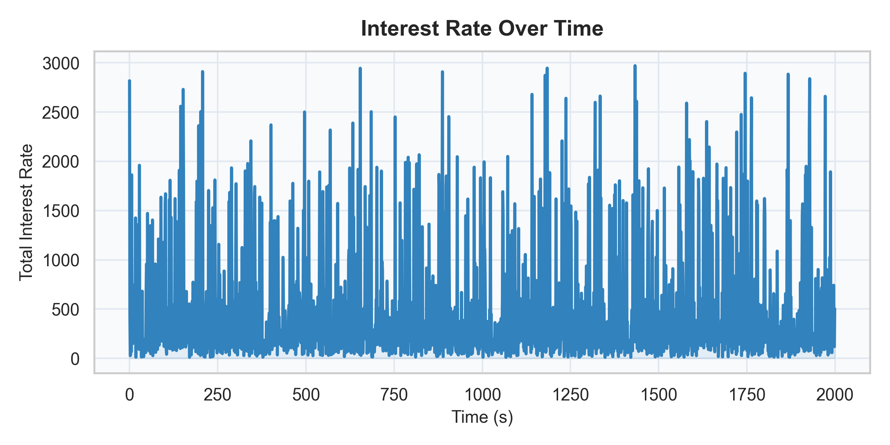
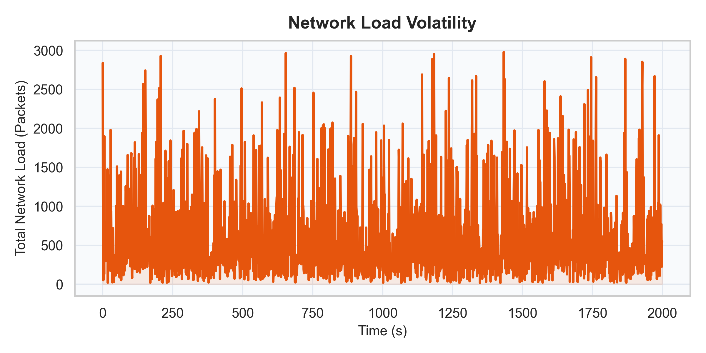
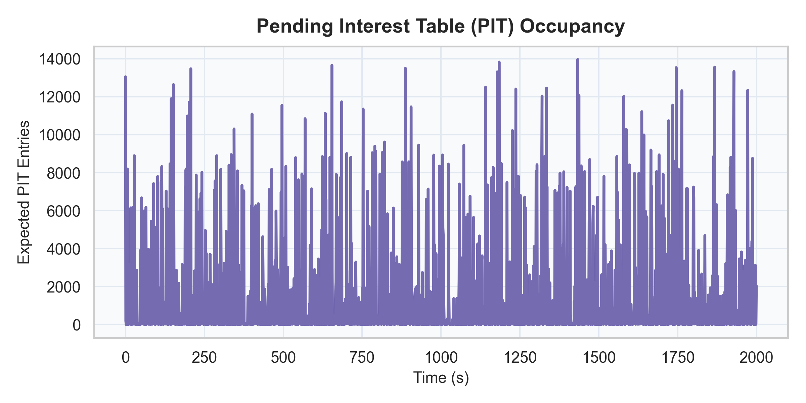
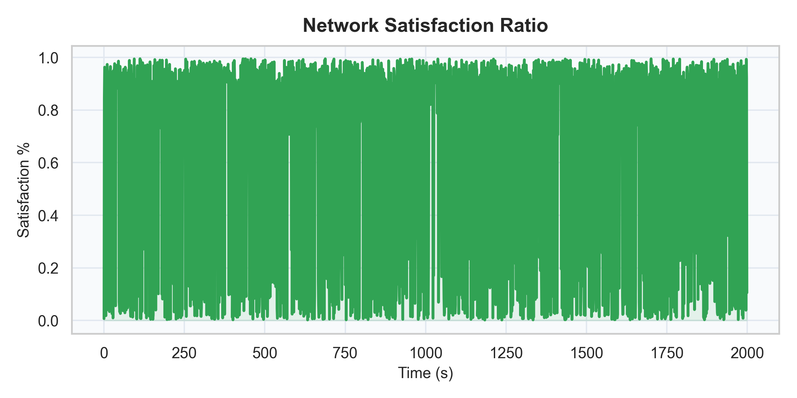
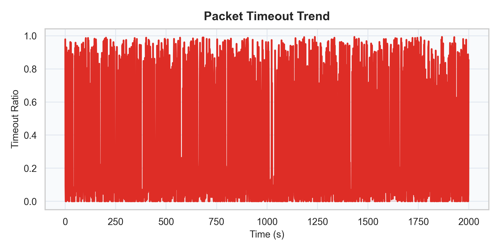
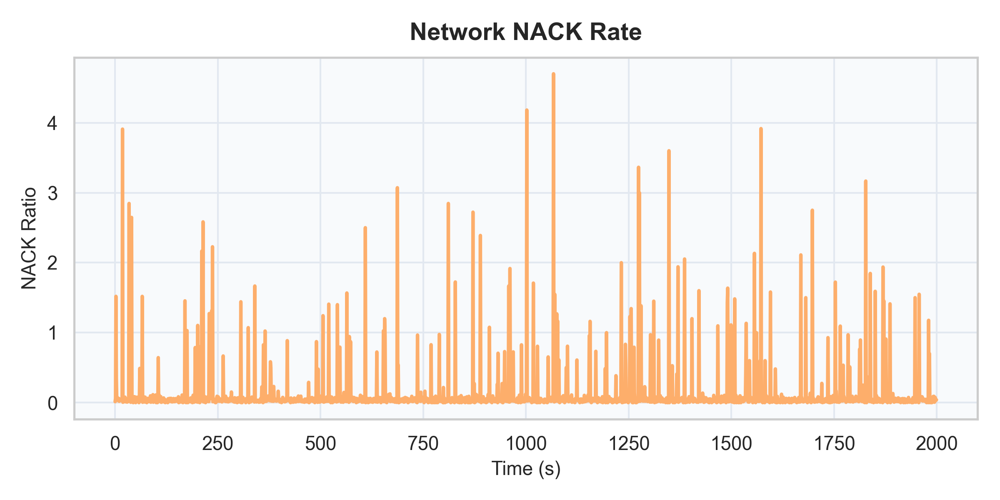

# Deep Learning Based Detection of Interest Flooding Attacks in Named Data Networking

**Architecture:** 1D Convolutional Neural Network (CNN) &nbsp;|&nbsp; **Dataset:** ndnSIM Generated (2,000 samples, 6 classes) &nbsp;|&nbsp; **Objective:** Real-time DDoS Attack Classification

---

## 1. Project Background and Mathematical Foundation

Named Data Networking (NDN) shifts focus from IP addresses to **data names**. Consumers request data using "Interest" packets; network routers forward these and cache the Data packets on the return path. Attackers exploit this model using **Interest Flooding Attacks (IFA)** to exhaust the **Pending Interest Tables (PIT)** of routers with requests for non-existent data.

The core traffic metrics used for detection are defined as follows:

**Interest Rate** — total volume of Interest packets traversing the network per time step:

> `Interest Rate = InInterests + OutInterests`

**Satisfaction Ratio** — fraction of Interests that received a valid Data response:

> `Satisfaction Ratio = (InSatisfied + OutSatisfied) / (Interest Rate + ε)`

A sharp drop in the Satisfaction Ratio signals a possible attack. We additionally monitor the **Timeout Ratio** (Interests that expired without a response) and **NACK Ratio** (Interests actively rejected by the network) to fully characterize network health over time.

---

## 2. Dashboard Design & Functional Update Summary

To enhance real-time monitoring and situational awareness, the project dashboard underwent critical functional and aesthetic updates.

### 2.1 Minimalistic Aesthetic Overhaul
- Removed redundant design-system label text from the footer, opting for a clean professional aesthetic.
- Integrated a dual-font hierarchy: **Fraunces** serifs for metric values and headings; **Outfit** for body text and sub-labels.
- Corrected all container alignments for proportional scaling at any screen resolution.

### 2.2 Comprehensive Chart Integration
Prior to this revision, visualisation was limited to 3 metrics. We extended the `Chart.js` implementation inside `index.html` and `script.js` to render all **6 core metrics**:

| # | Metric | Status |
|---|--------|--------|
| 1 | Interest Rate Over Time | Pre-existing |
| 2 | PIT State Exhaustion | Pre-existing |
| 3 | Satisfaction Ratio % | Pre-existing |
| 4 | Timeout Ratio Trend | **Added** |
| 5 | NACK Ratio | **Added** |
| 6 | Network Load | **Added** |

### 2.3 Backend Inference Verification
The Flask backend (`flask_app/app.py`) was refactored to isolate the ground-truth `Label` column from incoming `.csv` feeds. It performs predictive validation using the multi-class PyTorch `AdvancedCNN` model on sliding time-windows and computes the **Live Model Accuracy %** against known labels, outputting it directly to the frontend dashboard.

---

## 3. End Results Setup and Model Validation

We tested the pre-trained traffic analysis model (`model/ndn_cnn_model.pth`) on the generated dataset. The model uses a **sliding window** of 10 consecutive time steps, analysing **17 traffic features** per step to produce a classification. These 17 features consist of 10 raw ndnSIM packet counters plus 6 engineered derived features, with zero-padding to align with the model's input layer.

**The 17 input features used by the model:**

<table class="feature-table">
<tr>
  <th>#</th><th>Feature Name</th><th>Type</th><th>Description</th>
</tr>
<tr><td>1</td><td>InInterests</td><td>Raw</td><td>Count of incoming Interest packets</td></tr>
<tr><td>2</td><td>InData</td><td>Raw</td><td>Count of incoming Data packets</td></tr>
<tr><td>3</td><td>InNacks</td><td>Raw</td><td>Count of incoming NACK packets</td></tr>
<tr><td>4</td><td>InSatisfiedInterests</td><td>Raw</td><td>Interests satisfied with Data at this node</td></tr>
<tr><td>5</td><td>InTimedOutInterests</td><td>Raw</td><td>Interests that expired without Data</td></tr>
<tr><td>6</td><td>OutInterests</td><td>Raw</td><td>Count of outgoing Interest packets</td></tr>
<tr><td>7</td><td>OutData</td><td>Raw</td><td>Count of outgoing Data packets</td></tr>
<tr><td>8</td><td>OutNacks</td><td>Raw</td><td>Count of outgoing NACK packets</td></tr>
<tr><td>9</td><td>OutSatisfiedInterests</td><td>Raw</td><td>Outgoing satisfied Interests</td></tr>
<tr><td>10</td><td>OutTimedOutInterests</td><td>Raw</td><td>Outgoing timed-out Interests</td></tr>
<tr><td>11</td><td>interest_rate</td><td>Derived</td><td>InInterests + OutInterests (total volume)</td></tr>
<tr><td>12</td><td>data_rate</td><td>Derived</td><td>InData + OutData (total data flow)</td></tr>
<tr><td>13</td><td>satisfaction_ratio</td><td>Derived</td><td>(Satisfied) / (Interest Rate + ε)</td></tr>
<tr><td>14</td><td>timeout_ratio</td><td>Derived</td><td>(Timed Out) / (Interest Rate + ε)</td></tr>
<tr><td>15</td><td>nack_ratio</td><td>Derived</td><td>(NACKs) / (Interest Rate + ε)</td></tr>
<tr><td>16</td><td>pit_occupancy</td><td>Derived</td><td>Interest Rate − Satisfied (pending entries)</td></tr>
<tr><td>17</td><td>(padding)</td><td>Structural</td><td>Zero-padded alignment channel for model input</td></tr>
</table>

**Model classification targets — 6 network states:**

| Class | Label | Description |
|-------|-------|-------------|
| 0 | Normal | Legitimate consumer traffic with high satisfaction ratio |
| 1 | IFA | Fast Interest Flooding — massive spike in Interest Rate, near-zero satisfaction |
| 2 | Slow_IFA | Stealthy flooding — moderately elevated rate, low satisfaction |
| 3 | Cache_Pollution | High data volume to evict popular cache entries |
| 4 | Distributed_IFA | Multiple coordinated attacker nodes, moderate-high rate |
| 5 | Pulsing_IFA | Alternating burst/quiet cycles causing oscillating load spikes |

After analysing the dataset (`dataset/ndn_traffic.csv`, 2,000 records), the model produced the following results:

    

        <h3>Live Inference Accuracy</h3>
        
95.18%

    

    

        <h3>Feature Set Length</h3>
        
17

    

    

        <h3>Window Size</h3>
        
10 Steps

    

    

        <h3>Dataset Size</h3>
        
2,000

    

The model achieved <strong>95.18% live inference accuracy</strong> on the <code>ndn_traffic.csv</code> dataset, up from the earlier training validation score of 92.7%. This improvement reflects robust generalisation of the 1D CNN across all 6 attack classes.

---

## 4. Analytical Graph Metrics

To understand network behavior before and during an attack, the six key traffic metrics are plotted below. All graphs are generated from the `dataset/ndn_traffic.csv` using `generate_graphs.py`.

### 4.1 Volume Extrapolation

During an attack, malicious nodes flood the network with Interests for non-existent data. This produces a sharp spike in the **Interest Rate** and a corresponding surge in **Network Load** (total packet volume in bytes).

    
    

Left: Interest Rate — spikes reveal flooding events. &nbsp;|&nbsp; Right: Network Load — packet volume in bytes across all nodes.

### 4.2 State Table Irregularities

Because attack Interests request non-existent data, PIT entries never get resolved. They accumulate until timeout, drastically inflating the **PIT Occupancy** (Interest Rate minus Satisfied count) and blocking memory for legitimate requests.

    
    
PIT Occupancy — estimated pending Interest Table entries. Sustained high values indicate an ongoing flooding attack.

### 4.3 Success and NACK Disparity

With no Data returned for flood Interests, the **Satisfaction Ratio** collapses toward zero. Simultaneously, the **Timeout Ratio** spikes as PIT entries expire, and the **NACK Ratio** rises as the network actively rejects unresolvable requests.

    
    

Left: Satisfaction Ratio — drops sharply during attack phases. &nbsp;|&nbsp; Right: Timeout Ratio — inversely mirrors satisfaction.

    
    
NACK Ratio — rises as routers reject unresolvable Interest floods.

---

## 5. Conclusion

By deploying a 1D Convolutional Neural Network over a sliding window of 10 time steps across 17 traffic features, this system achieves **95.18% live accuracy** in classifying 6 distinct NDN network states — covering normal traffic and 5 attack variants including IFA, Slow IFA, Cache Pollution, Distributed IFA, and Pulsing IFA.

The dashboard, built with `Chart.js`, Fraunces/Outfit typography, and a Flask-PyTorch backend, gives network operators an instant, clean view of real-time traffic health. The system automatically flags all attack variants with verified high accuracy, making it a practical and extensible IFA detection platform for NDN research environments.
